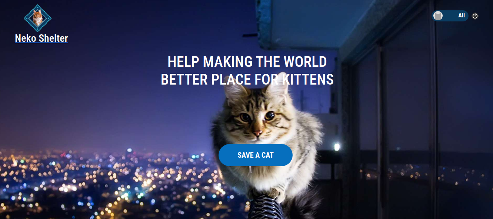
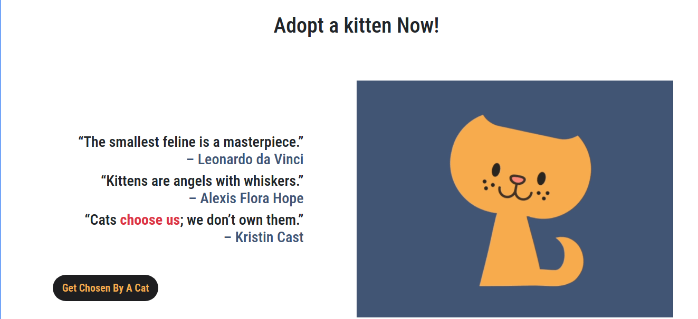
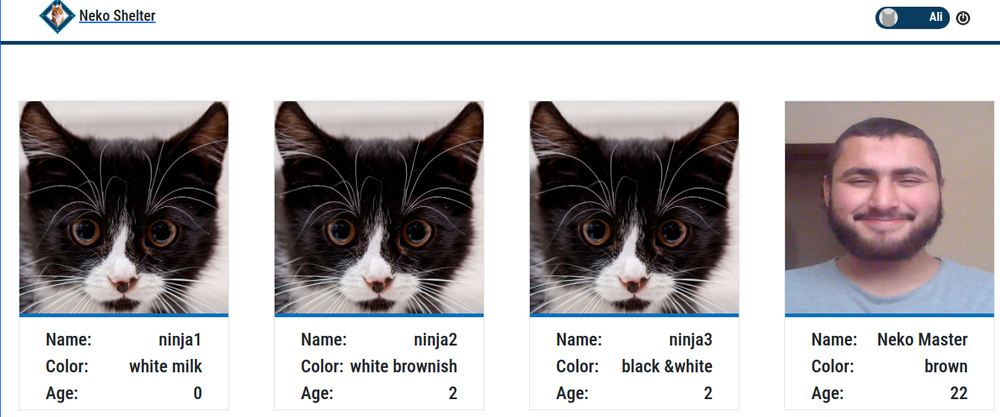
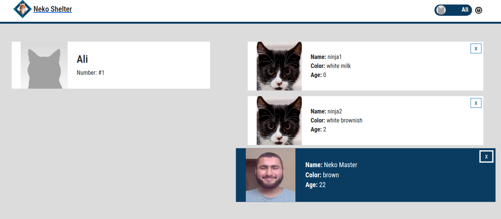
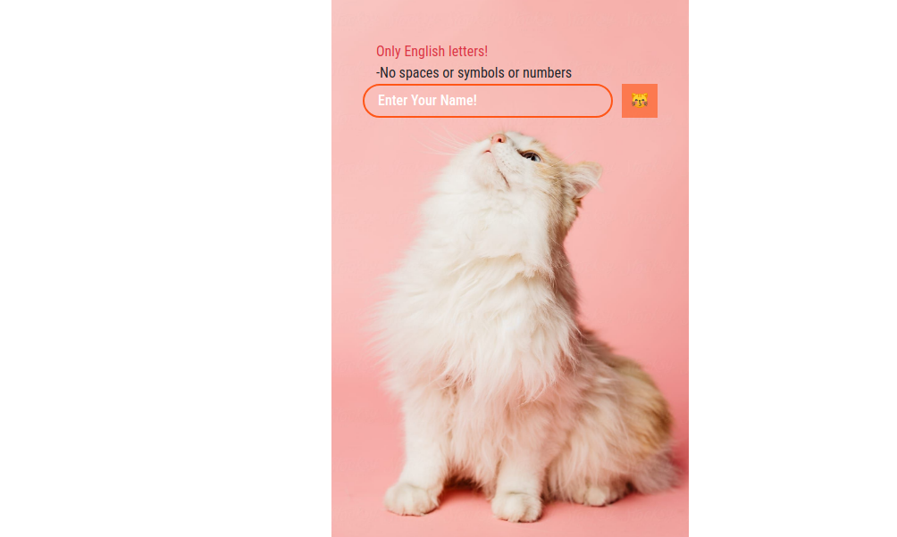

# 😸 Neko's Shelter 😸

> A React-Redux-Rails Project is about creating a shelter website for kittens using Rails as the backend and React as the frontend.
>  >  >  >  > 

Something that most people don't know about me is that I've a nickname "Neko Master" because I adore cats!
This is my final capstone and I wanted it to be something special to 😽s.

## Built with

- Node.js
- React
- React-DOM
- React-Router
- Thunk
- JEST
- React Testing Library
- React-Create-App
- Redux
- npm
- CSS
- ES6
- Rails
- Rspec
- CORS
- API

## BACKEND Repository

[Rails](https://github.com/AbdelrhmanAmin/CAT_SHOP_API_BACKEND/tree/testing)

## Live Demo

[Live Demo Link](https://peaceful-refuge-36750.herokuapp.com/)

## Getting Started

To get a local copy up and running follow these simple example steps.

### Prerequisites

- A smile. 😸

### Setup

1- Clone the repository

```
    git clone https://github.com/AbdelrhmanAmin/Cat_shop_react.git
```

2- Open the folder.

```
    cd Cat_shop_react
```

3- install the app

```
    npm install
```

4- Run the app

```
    npm start
```

5- Test the app

```
    npm test
```

## Author

😎 **Abdo Amin**

- GitHub: [@Abdelrhman-Amin](https://github.com/AbdelrhmanAmin)
- Twitter: [@Abdo Amin](https://twitter.com/AbdoAmi60489112)
- LinkedIn: [@Abdo Amin](https://www.linkedin.com/in/abdoamin/)

## Show your support

Give a ⭐️ if you like this project!

## Acknowledgments

- [Microverse](https://www.microverse.org/).
- <div>Icons made by <a href="https://www.freepik.com" title="Freepik">Freepik</a> from <a href="https://www.flaticon.com/" title="Flaticon">www.flaticon.com</a></div>
- <div>Icons made by <a href="https://www.flaticon.com/authors/dave-gandy" title="Dave Gandy">Dave Gandy</a> from <a href="https://www.flaticon.com/" title="Flaticon">www.flaticon.com</a></div>
